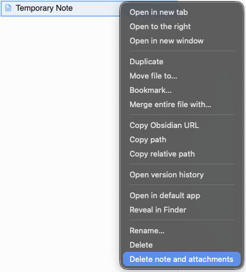
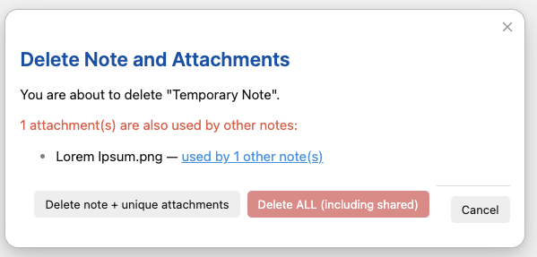
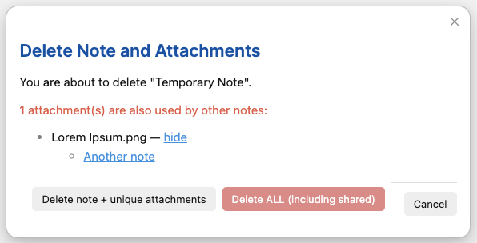
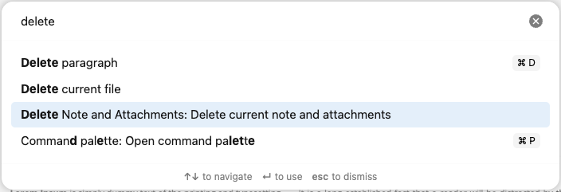

# Delete Note and Attachments

An Obsidian plugin that adds a "Delete note and attachments" option to the file context menu. When you delete a note, all its embedded attachments (images, PDFs, videos, etc.) are automatically deleted too.

> **Note**: This plugin currently works with single notes only. Multi-select deletion is planned for a future release.

## Screenshots

### Right-click menu in file explorer


### Confirmation dialog with shared attachment


### See which notes use a shared attachment


### Also available in command palette


## Features

- **Right-click menu**: Adds "Delete note and attachments" to the file explorer context menu
- **Command palette**: Also available via command palette for the active note
- **Smart deletion**: Only deletes attachments that are unique to the note being deleted
- **Shared attachment handling**: If an attachment is used by other notes, you get a choice:
  - Delete only the note and unique attachments
  - Delete everything including shared attachments
- **See usage**: Click to see which other notes use a shared attachment
- **Confirmation dialog**: Shows what will be deleted before proceeding
- **Moves to trash**: Uses Obsidian's trash system (system or Obsidian trash based on your settings)

## Installation

### From Community Plugins

1. Open Obsidian Settings → Community plugins
2. Click "Browse" and search for "Delete Note and Attachments"
3. Install and enable the plugin

### Manual Installation

1. Download `main.js` and `manifest.json` from the [latest release](https://github.com/mandavap/obsidian-delete-note-and-attachments/releases)
2. Create a folder called `delete-note-and-attachments` in your vault's `.obsidian/plugins/` directory
3. Copy the downloaded files into this folder
4. Enable the plugin in Obsidian Settings → Community plugins

### Build from Source

```bash
cd delete-note-and-attachments
npm install
npm run build
```

Then copy `main.js` and `manifest.json` to your vault's plugins folder.

## Usage

1. Right-click on any markdown note in the file explorer
2. Select "Delete note and attachments"
3. Review the confirmation dialog showing which attachments will be deleted
4. Click "Delete" to proceed or "Cancel" to abort

Or use the command palette:
1. Open a note
2. Press `Ctrl/Cmd + P` to open command palette
3. Search for "Delete current note and attachments"

## How It Works

1. Scans the note for all embedded (`![[]]`) and linked (`[[]]`) non-markdown files
2. Checks each attachment to see if it's referenced by other notes
3. Shows a confirmation dialog listing:
   - Unique attachments (will be deleted)
   - Shared attachments (click to see which notes use them)
4. Deletes selected files to trash

## License

This project is licensed under the [MIT License](LICENSE).
